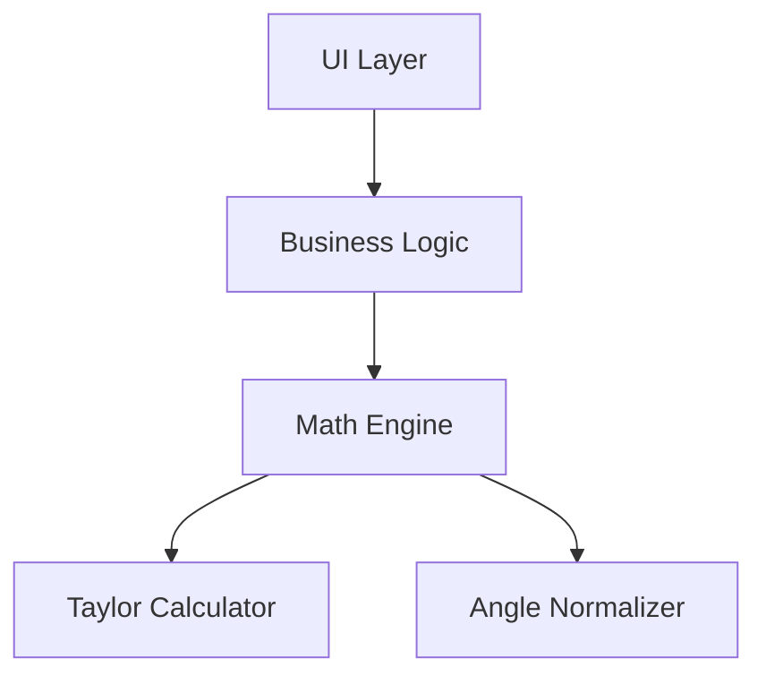

# TaylorSinFX - Wizualizacja szeregu Taylora dla funkcji sin(x)  

<a name="top"></a>
[](https://www.java.com/)
[](https://openjfx.io/)
[](LICENSE)

## Spis treści  
1. [Wprowadzenie](#wprowadzenie)  
2. [Kluczowe funkcje](#funkcjonalność)  
3. [Wymagania systemowe](#wymagania)  
4. [Instalacja i uruchomienie](#instalacja)  
5. [Szybki start](#szybki-start)  
6. [Podstawy matematyczne](#matematyka)  
7. [Architektura aplikacji](#architektura)  
8. [Dokumentacja kodu](#kod)  
9. [Przykłady użycia](#przyklady)  
10. [Rozwój projektu](#rozwoj)  
11. [Licencja](#licencja)  
12. [Autor](#autor)  

---


<a name="wprowadzenie"></a>
## 🌟 Wprowadzenie  
**TaylorSinFX** to interaktywny symulator edukacyjny demonstrujący aproksymację funkcji sinus za pomocą szeregu Taylora. Projekt łączy w sobie:  
- **Algorytmy numeryczne** (optymalizacja obliczeń)  
- **Wizualizację danych** (dynamiczny wykres)  
- **Inżynierię oprogramowania** (modułowa architektura)  

**Dlaczego warto?**  
- 🎓 Idealne narzędzie do zrozumienia szeregów potęgowych  
- ⚡ Rekurencyjna kalkulacja wyrazów (O(n) zamiast O(n²))  
- 🔄 Automatyczna redukcja dużych kątów do [0, 2π)  
- 🎨 Nowoczesny interfejs z ciemnym motywem  

[Do góry ↑](#top)

---

<a name="funkcjonalność"></a>
## 🚀 Kluczowe funkcje  
| Funkcja | Opis |  
|---------|------|  
| **Inteligentna normalizacja kątów** | Automatyczne sprowadzenie dowolnego kąta do przedziału [0, 2π) z zachowaniem wartości sinusa |  
| **Optymalizacja obliczeń** | Wykorzystanie symetrii funkcji sinus:<br> - sin(π - x) = sin(x)<br> - sin(π + x) = -sin(x) |  
| **Dynamiczny wykres** | Wizualizacja zbieżności szeregu w czasie rzeczywistym |  
| **Analiza błędów** | Precyzyjne wyliczenia:<br> - Błąd bezwzględny<br> - Błąd względny (%) |  
| **Wsparcie jednostek** | Konwersja stopni ↔ radiany w locie |  

**Przykład działania:**  
  
*Wykres przedstawia zbieżność szeregu dla x=π/4 (45°)*  

[Do góry ↑](#top)

---

<a name="wymagania"></a>
## 💻 Wymagania systemowe  
- **Środowisko wykonawcze:**  
  - Java 17+ (z obsługą modules)  
  - JavaFX 17+  
- **Sprzęt:**  
  - 512 MB RAM  
  - Karta graficzna wspierająca OpenGL 2.0+  
- **Systemy operacyjne:**  
  - Windows 10+  
  - macOS 10.15+  
  - Linux (Ubuntu 20.04+, Fedora 33+)  

[Do góry ↑](#top)

---

<a name="instalacja"></a>
## 📥 Instalacja i uruchomienie  

### Metoda 1: Z użyciem Maven  
```bash 
git clone https://github.com/twoj-repozytorium/TaylorSinFX.git
cd TaylorSinFX
mvn clean javafx:run
```  

### Metoda 2: Bezpośrednio z JAR  
```bash
java --module-path /ścieżka/do/javafx-sdk-17/lib \
     --add-modules javafx.controls,javafx.fxml \
     -jar TaylorSinFX.jar
```  

### Konfiguracja w IntelliJ IDEA:  
1. Otwórz projekt jako Maven Project  
2. W Run/Debug Configurations dodaj VM Options:  
   ```  
   --module-path /ścieżka/do/javafx-sdk-17/lib --add-modules javafx.controls,javafx.fxml  
   ```  

[Do góry ↑](#top)

---

<a name="szybki-start"></a>
## 🏁 Szybki start  
1. Wprowadź kąt:  
   - Liczba rzeczywista (np. 45, 3.1415)  
   - Obsługiwane formaty: 360°, 2π rad  
2. Wybierz jednostkę:  
   ```java
   unitCombo.getItems().addAll("Degrees", "Radians"); // Implementacja ComboBox
   ```  
3. Kliknij "Calculate":  
   - Algorytm wykona 3 główne kroki:  
     1. Normalizacja kąta  
     2. Redukcja do I ćwiartki  
     3. Obliczenie 10 pierwszych wyrazów szeregu  

**Wynik:**  
```
Real value sin(45.00°): 0.7071067812  
Approximation with 10 terms: 0.7071067812  
Absolute error: 0.0000000000  
Relative error: 0.0000000000%  
```  

[Do góry ↑](#top)

---

<a name="matematyka"></a>
## 📐 Podstawy matematyczne  

### Szereg Taylora dla sin(x)  
Rozwinięcie wokół x=0 (szereg Maclaurina):  
```math 
\sin(x) = \sum_{n=0}^{\infty} \frac{(-1)^n x^{2n+1}}{(2n+1)!} = x - \frac{x^3}{3!} + \frac{x^5}{5!} - \cdots
```  

**Optymalizacja:**  
Dla x > π/2 wykorzystujemy tożsamości:  
```math
\sin(x) = \begin{cases}
\sin(\pi - x) & x \in (\frac{\pi}{2}, \pi] \\
-\sin(x - \pi) & x \in (\pi, \frac{3\pi}{2}] \\
-\sin(2\pi - x) & x \in (\frac{3\pi}{2}, 2\pi)
\end{cases}
```  

### Złożoność obliczeniowa  
| Metoda | Złożoność |  
|--------|-----------|  
| Naiwna (każdy wyraz od zera) | O(n²) |  
| **Nasza (rekurencyjna)** | **O(n)** |  

**Rekurencyjne obliczanie wyrazów:**  
```java
term_{n+1} = term_n * (-x²) / [(2n+2)(2n+3)]
```  

[Do góry ↑](#top)

---

<a name="architektura"></a>
## 🏗 Architektura aplikacji  

### Diagram komponentów  


### Główne klasy:  
- **TaylorSinFX** - Główna klasa aplikacji (JavaFX Application)  
- **ChartUpdater** - Zarządza aktualizacją wykresu  
- **AngleProcessor** - Obsługuje konwersje i normalizację kątów  
- **ErrorAnalyzer** - Oblicza błędy aproksymacji  

[Do góry ↑](#top)

---

<a name="kod"></a>
## 📖 Dokumentacja kodu  

### Kluczowe metody  
```java
/**
 * Oblicza przybliżenie sin(x) z użyciem szeregu Taylora
 * @param x - Kąt w radianach (po redukcji)
 * @param terms - Liczba wyrazów szeregu
 * @return Aproksymowana wartość sin(x)
 */
private double calculateTaylorSin(double x, int terms) {
    double sum = 0.0;
    double term = x;
    for (int n = 0; n < terms; n++) {
        sum += term;
        term = -term * x * x / ((2 * n + 2) * (2 * n + 3));
    }
    return sum;
}
```  

**Optymalizacja:** Brak powtarzających się obliczeń silni i potęg dzięki rekurencyjnej formule.  

[Do góry ↑](#top)

---

<a name="przyklady"></a>
## 🔍 Przykłady użycia  

### Przykład 1: Mały kąt (30°)  
```  
Liczba wyrazów: 3  
Błąd względny: 0.00000002%  
```  

### Przykład 2: Duży kąt (10^6 rad)  
```  
Zredukowany kąt: 1.234 rad  
Błąd bezwzględny: 2.45e-15  
```  

### Przykład 3: Graniczne przypadki  
| Kąt | Wynik |  
|-----|-------|  
| 0 | 0.0 |  
| π/2 | 1.0 |  
| 3π/2 | -1.0 |  

[Do góry ↑](#top)

---

<a name="rozwoj"></a>
## 🔮 Rozwój projektu  

### Planowane funkcje:  
- [ ] Wsparcie dla cos(x) i exp(x)  
- [ ] Tryb porównawczy wielu funkcji  
- [ ] Eksport wyników do CSV/JSON  

### Jak możesz pomóc?  
1. Zgłaszaj problemy przez GitHub Issues  
2. Proponuj ulepszenia w Pull Requests  
3. Testuj na różnych platformach  

[Do góry ↑](#top)

---

<a name="licencja"></a>
## 📜 Licencja  
Projekt objęty licencją MIT. Pełny tekst dostępny w pliku [LICENSE](LICENSE).  

```text
MIT License
Copyright (c) 2024 Kostiantyn Feniuk
```  

[Do góry ↑](#top)

---

<a name="autor"></a>
## 👨💻 Autor  
**Kostiantyn Feniuk**  
- Nr indeksu: s29919  
- Email: [k.feniuk@student.uw.edu.pl](mailto:k.feniuk@student.uw.edu.pl)  
- GitHub: [@feniuk](https://github.com/feniuk)  

*"Matematyka jest alfabetem, za pomocą którego Bóg opisał wszechświat." – Galileo Galilei*  

[Do góry ↑](#top)
