<a name="top"></a>
[](https://www.java.com/)
[](https://openjfx.io/)
[](LICENSE)
# TaylorSinFX - Wizualizacja szeregu Taylora dla funkcji sin(x)  


## Spis treści  
1. [Wprowadzenie](#wprowadzenie)  
2. [Kluczowe funkcje](#funkcjonalność)  
3. [Wymagania systemowe](#wymagania)  
4. [Instalacja i uruchomienie](#instalacja)  
5. [Szybki start](#szybki-start)  
6. [Podstawy matematyczne](#matematyka)  
7. [Architektura aplikacji](#architektura)  
8. [Dokumentacja kodu](#kod)  
9. [Przykłady użycia](#przyklady)  
10. [Rozwój projektu](#rozwoj)  
12. [Paleta kolorów i stylizacja](#szczegóły-implementacji)
13. [Autor](#autor)  

---

<a name="wprowadzenie"></a>
## 🌟 Wprowadzenie  
**TaylorSinFX** to interaktywny symulator edukacyjny demonstrujący aproksymację funkcji sinus za pomocą szeregu Taylora. Projekt łączy w sobie:  
- **Algorytmy numeryczne** (optymalizacja obliczeń)  
- **Wizualizację danych** (dynamiczny wykres)  
- **Inżynierię oprogramowania** (modułowa architektura)  

**Dlaczego warto?**  
- 🎓 Idealne narzędzie do zrozumienia szeregów potęgowych  
- ⚡ Rekurencyjna kalkulacja wyrazów (O(n) zamiast O(n²))  
- 🔄 Automatyczna redukcja dużych kątów do [0, 2π)  
- 🎨 Nowoczesny interfejs z ciemnym motywem  

[Do góry ↑](#top)

---

<a name="funkcjonalność"></a>
## 🚀 Kluczowe funkcje  
| Funkcja | Opis |  
|---------|------|  
| **Inteligentna normalizacja kątów** | Automatyczne sprowadzenie dowolnego kąta do przedziału [0, 2π) z zachowaniem wartości sinusa |  
| **Optymalizacja obliczeń** | Wykorzystanie symetrii funkcji sinus:<br> - sin(π - x) = sin(x)<br> - sin(π + x) = -sin(x) |  
| **Dynamiczny wykres** | Wizualizacja zbieżności szeregu w czasie rzeczywistym |  
| **Analiza błędów** | Precyzyjne wyliczenia:<br> - Błąd bezwzględny<br> - Błąd względny (%) |  
| **Wsparcie jednostek** | Konwersja stopni ↔ radiany w locie |  

**Przykład działania:**  
  
*Wykres przedstawia zbieżność szeregu dla x=π/4 (45°)*  

[Do góry ↑](#top)

---

<a name="wymagania"></a>
## 💻 Wymagania systemowe  
- **Środowisko wykonawcze:**  
  - Java 17+ (z obsługą modules)  
  - JavaFX 17+  
- **Sprzęt:**  
  - 512 MB RAM  
  - Karta graficzna wspierająca OpenGL 2.0+  
- **Systemy operacyjne:**  
  - Windows 10+  
  - macOS 10.15+  
  - Linux (Ubuntu 20.04+, Fedora 33+)  

[Do góry ↑](#top)

---

<a name="instalacja"></a>
## 📥 Instalacja i uruchomienie  

### Metoda 1: Z użyciem Maven  
```bash 
git clone --depth 1 https://github.com/Sou1ence/Taylor-sin-.git
cd TaylorSinFX
mvn clean javafx:run
```  

### Metoda 2: Bezpośrednio z JAR  
```bash
java --module-path /ścieżka/do/javafx-sdk-17/lib \
     --add-modules javafx.controls,javafx.fxml \
     -jar TaylorSinFX.jar
```  

### Konfiguracja w IntelliJ IDEA:  
1. Otwórz projekt jako Maven Project  
2. W Run/Debug Configurations dodaj VM Options:  
   ```  
   --module-path /ścieżka/do/javafx-sdk-17/lib --add-modules javafx.controls,javafx.fxml  
   ```  

[Do góry ↑](#top)

---

<a name="szybki-start"></a>
## 🏁 Szybki start  
1. Wprowadź kąt:  
   - Liczba rzeczywista (np. 45, 3.1415)  
   - Obsługiwane formaty: 360°, 2π rad  
2. Wybierz jednostkę:  
   ```java
   unitCombo.getItems().addAll("Degrees", "Radians"); // Implementacja ComboBox
   ```  
3. Kliknij "Calculate":  
   - Algorytm wykona 3 główne kroki:  
     1. Normalizacja kąta  
     2. Redukcja do I ćwiartki  
     3. Obliczenie 10 pierwszych wyrazów szeregu  

**Wynik:**  
```
Real value sin(45.00°): 0.7071067812  
Approximation with 10 terms: 0.7071067812  
Absolute error: 0.0000000000  
Relative error: 0.0000000000%  
```  

[Do góry ↑](#top)

---

<a name="matematyka"></a>
## 📐 Podstawy matematyczne  

### Szereg Taylora dla sin(x)  
Rozwinięcie wokół x=0 (szereg Maclaurina):  
```math 
\sin(x) = \sum_{n=0}^{\infty} \frac{(-1)^n x^{2n+1}}{(2n+1)!} = x - \frac{x^3}{3!} + \frac{x^5}{5!} - \cdots
```  

**Optymalizacja:**  
Dla x > π/2 wykorzystujemy tożsamości:  
```math
\sin(x) = \begin{cases}
\sin(\pi - x) & x \in (\frac{\pi}{2}, \pi] \\
-\sin(x - \pi) & x \in (\pi, \frac{3\pi}{2}] \\
-\sin(2\pi - x) & x \in (\frac{3\pi}{2}, 2\pi)
\end{cases}
```  

### Złożoność obliczeniowa  
| Metoda | Złożoność |  
|--------|-----------|  
| Naiwna (każdy wyraz od zera) | O(n²) |  
| **Nasza (rekurencyjna)** | **O(n)** |  

**Rekurencyjne obliczanie wyrazów:**  
```java
term_{n+1} = term_n * (-x²) / [(2n+2)(2n+3)]
```  

[Do góry ↑](#top)

---

<a name="architektura"></a>
## 🏗 Architektura aplikacji  

### Diagram komponentów  

```mermaid
---
config:
  theme: dark
  themeVariables:
    primaryColor: '#272726'
    primaryTextColor: '#dfdfdc'
    primaryBorderColor: '#4f4f4c'
    lineColor: '#ca7b5d'
    secondaryColor: '#3f3f3c'
    tertiaryColor: '#ca7b5d'
    noteBkgColor: '#242423'
    noteTextColor: '#7f72c3'
    edgeLabelBackground: '#2c2c2a'
    fontFamily: ''
    mainBkg: '#2c2c2a'
    nodeBorder: '#4f4f4c'
    clusterBkg: '#3f3f3c'
    clusterBorder: '#4f4f4c'
    defaultLinkColor: '#ca7b5d'
    titleColor: '#dfdfdc'
  layout: fixed
---
flowchart TB
 subgraph UI["Interfejs użytkownika"]
    direction TB
        inputForm["Formularz wejściowy"]
        angleField["Pole kąta"]
        unitCombo["Wybór jednostki\n(Stopnie/Radiany)"]
        calcButton["Przycisk Calculate"]
  end
 subgraph Display["Elementy wyświetlania"]
    direction TB
        chart["Wykres LineChart"]
        infoBox["Pole informacyjne"]
        realValue["Wartość rzeczywista sin(x)"]
        approxValue["Wartość przybliżona sin(x)"]
        absError["Błąd bezwzględny"]
        relError["Błąd względny (%)"]
  end
 subgraph TaylorSeries["Obliczenia szeregu Taylora"]
    direction TB
        initTaylor["Inicjalizacja pierwszego\nwyrazu szeregu (x)"]
        loopTaylor["Pętla dla kolejnych\nwyrazów szeregu"]
        calculateTerm["Obliczenie kolejnego\nwyrazu szeregu\n(-1)^n * x^(2n+1) / (2n+1)!"]
        sumTerms["Sumowanie wyrazów szeregu"]
  end
 subgraph Calculations["Obliczenia matematyczne"]
    direction TB
        convertToRad["Konwersja kąta do radianów"]
        normAngle["Normalizacja kąta\n(redukcja do zakresu 0-2π)"]
        applySymmetry["Zastosowanie symetrii\nfunkcji sinus"]
        calculateRef["Obliczenie dokładnej\nwartości sin(x)"]
        TaylorSeries
  end
    start(["START"]) --> initialize["Inicjalizacja aplikacji JavaFX"]
    initialize --> setupUI["Konfiguracja interfejsu użytkownika"]
    inputForm --> angleField & unitCombo & calcButton
    infoBox --> realValue & approxValue & absError & relError
    setupUI --> UI & Display
    calcButton -- Akcja kliknięcia --> parseInput["Parsowanie danych wejściowych"]
    parseInput -- Jeśli błąd --> showError["Wyświetl komunikat błędu"]
    parseInput -- Dane poprawne --> updateChart["Wywołanie updateChart()"]
    initTaylor --> loopTaylor
    loopTaylor --> calculateTerm
    calculateTerm --> sumTerms
    sumTerms -- Kolejny wyraz --> loopTaylor
    convertToRad --> normAngle
    normAngle --> applySymmetry
    applySymmetry --> calculateRef & TaylorSeries
    updateChart --> Calculations
    Calculations --> updateChartData["Aktualizacja danych wykresu"] & calcErrors["Obliczenie błędów\napproximacji"]
    updateChartData --> chart
    calcErrors --> infoBox
    showError -- Powrót do --> inputForm
    chart -- Proces zakończony --> finish(["KONIEC"])
    infoBox -- Proces zakończony --> finish
     inputForm:::inputBox
     angleField:::inputBox
     unitCombo:::inputBox
     calcButton:::calcBox
     chart:::chartBox
     infoBox:::dataBox
     realValue:::dataBox
     approxValue:::dataBox
     absError:::dataBox
     relError:::dataBox
     initTaylor:::mathBox
     loopTaylor:::mathBox
     calculateTerm:::mathBox
     sumTerms:::mathBox
     convertToRad:::mathBox
     normAngle:::mathBox
     applySymmetry:::mathBox
     calculateRef:::mathBox
    classDef inputBox fill:#3f3f3c,stroke:#4f4f4c,color:#a19e96
    classDef calcBox fill:#ca7b5d,stroke:#ca7b5d,color:#dfdfdc
    classDef dataBox fill:#272726,stroke:#4f4f4c,color:#dfdfdc
    classDef mathBox fill:#242423,stroke:#4f4f4c,color:#7f72c3
    classDef chartBox fill:#272726,stroke:#4f4f4c,color:#dfdfdc

```  


### Główne klasy:  
- **TaylorSinFX** - Główna klasa aplikacji (JavaFX Application)  
- **ChartUpdater** - Zarządza aktualizacją wykresu  
- **AngleProcessor** - Obsługuje konwersje i normalizację kątów  
- **ErrorAnalyzer** - Oblicza błędy aproksymacji  

[Do góry ↑](#top)

---

<a name="kod"></a>
## 📖 Dokumentacja kodu  

### Kluczowe metody  
```java
/**
 * Oblicza przybliżenie sin(x) z użyciem szeregu Taylora
 * @param x - Kąt w radianach (po redukcji)
 * @param terms - Liczba wyrazów szeregu
 * @return Aproksymowana wartość sin(x)
 */
private double calculateTaylorSin(double x, int terms) {
    double sum = 0.0;
    double term = x;
    for (int n = 0; n < terms; n++) {
        sum += term;
        term = -term * x * x / ((2 * n + 2) * (2 * n + 3));
    }
    return sum;
}
```  

**Optymalizacja:** Brak powtarzających się obliczeń silni i potęg dzięki rekurencyjnej formule.  

[Do góry ↑](#top)

---

<a name="przyklady"></a>
## 🔍 Przykłady użycia  

### Przykład 1: Mały kąt (30°)  
```  
Liczba wyrazów: 3  
Błąd względny: 0.00000002%  
```  

### Przykład 2: Duży kąt (10^6 rad)  
```  
Zredukowany kąt: 1.234 rad  
Błąd bezwzględny: 2.45e-15  
```  

### Przykład 3: Graniczne przypadki  
| Kąt | Wynik |  
|-----|-------|  
| 0 | 0.0 |  
| π/2 | 1.0 |  
| 3π/2 | -1.0 |  

[Do góry ↑](#top)

---

<a name="rozwoj"></a>
## 🔮 Rozwój projektu  

### Planowane funkcje:  
- [ ] Wsparcie dla cos(x) i exp(x)  
- [ ] Tryb porównawczy wielu funkcji  
- [ ] Eksport wyników do CSV/JSON  

### Jak możesz pomóc?  
1. Zgłaszaj problemy przez GitHub Issues  
2. Proponuj ulepszenia w Pull Requests  
3. Testuj na różnych platformach  

[Do góry ↑](#top)

---


<a name="szczegóły-implementacji"></a>
## 🎨 Szczegóły implementacji

### Paleta kolorów i stylizacja

Aplikacja wykorzystuje starannie dobraną paletę kolorów dla optymalnej czytelności i nowoczesnego wyglądu:

| Kolor | Kod HEX | Podgląd | Zastosowanie |
|-------|---------|---------|--------------|
| Ciemny tło | `#2c2c2a` |  | Główne tło aplikacji |
| Formularz | `#3f3f3c` |  | Formularze wejściowe |
| Tło sekcji | `#272726` |  | Sekcje informacyjne |
| Tekst główny | `#a19e96` |  | Etykiety, opisy |
| Akcenty | `#ca7b5d` |  | Przyciski, linie wykresu |
| Informacje | `#7f72c3` |  | Wartości, komunikaty |
| Jasny tekst | `#dfdfdc` |  | Nagłówki, przyciski |

Alternatywnie, poniżej przedstawiono kolory w formacie inline dla lepszej kompatybilności:

-  `#2c2c2a` - Ciemne tło aplikacji
-  `#3f3f3c` - Tło formularzy
-  `#272726` - Tło sekcji informacyjnych
-  `#a19e96` - Kolor tekstu podstawowego
-  `#ca7b5d` - Kolor akcentów i elementów interaktywnych
-  `#7f72c3` - Kolor informacji i wartości
-  `#dfdfdc` - Jasny tekst na ciemnym tle

### Zasady stylizacji:

- **Kontrast i czytelność**: Wszystkie elementy zaprojektowano z myślą o kontraście 4.5:1 dla dostępności (WCAG AA)
- **Spójny design**: Jednolite zaokrąglenia narożników (3-5px) dla wszystkich elementów interfejsu
- **Elementy interaktywne**: Subtelne efekty hover dla wszystkich elementów klikalnych
- **Hierarchia wizualna**: Kolor akcentujący (`#ca7b5d`) wyróżnia najważniejsze elementy i akcje

### Kod CSS dla głównych elementów interfejsu:

```css
/* Główne tło aplikacji */
.root {
    -fx-background-color: linear-gradient(from 0% 0% to 0% 100%, #2c2c2a, #2f2f2e);
    -fx-font-size: 13px;
}

/* Stylizacja formularza */
.input-form {
    -fx-background-color: #3f3f3c;
    -fx-background-radius: 5px;
    -fx-padding: 15px;
}

/* Stylizacja przycisku */
.button {
    -fx-background-color: #ca7b5d;
    -fx-text-fill: #dfdfdc;
    -fx-background-radius: 3px;
}

/* Stylizacja wykresu */
.chart {
    -fx-background-color: #272726;
    -fx-padding: 10px;
}
.chart-series-line {
    -fx-stroke: #ca7b5d;
    -fx-stroke-width: 2px;
}

/* Stylizacja sekcji informacyjnej */
.info-box {
    -fx-background-color: #272726;
    -fx-background-radius: 5px;
    -fx-border-color: #4f4f4c;
}
.info-content {
    -fx-text-fill: #7f72c3;
}
```

---

<a name="autor"></a>
## 👨💻 Autor  
**Kostiantyn Feniuk**  
- Nr indeksu: s29919  
- Email: [s29919@pjwstk.edu.pl](mailto:k.feniuk@student.uw.edu.pl)  
- GitHub: [@Sou1ence ](https://github.com/feniuk)  

*Developed by Era*  

[Do góry ↑](#top)
